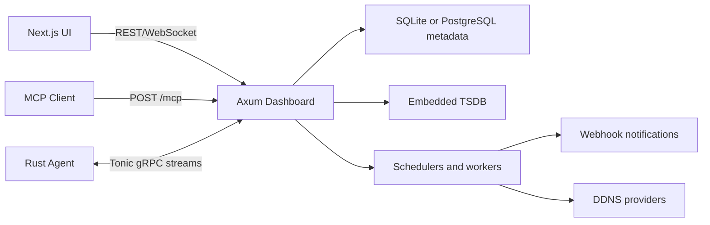

# 整体架构

## Workspace

Rust workspace 采用以下 crate：

- `xlstatus-common`：领域类型、错误码、权限类型、protobuf 生成代码、通用校验。
- `xlstatus-server`：Axum HTTP 服务、Tonic gRPC 服务、后台 worker、数据库访问、TSDB。
- `xlstatus-agent`：Agent CLI、采集器、任务执行器、系统服务集成。
- `xlstatus-tsdb`：嵌入式指标存储、写缓冲、查询和降采样。
- `xlstatus-xtask`：开发脚本、代码生成、打包辅助。

Next.js 前端位于 `web/`，通过 OpenAPI 和手写 realtime client 访问后端。

## 运行时组件

## 后端进程

目标：

- 单进程承载 REST、WebSocket、gRPC、MCP、后台 worker。
- 保持部署简单，第一版不做集群。

主要接口：

- REST：`/api/*`
- WebSocket：`/ws/servers`、`/ws/terminal/{session_id}`、`/ws/file/{session_id}`、`/ws/transfers`
- gRPC：`AgentService`
- MCP：`POST /mcp`、`GET /mcp/download/{token}`、`POST /mcp/upload/{token}`

端口：

- `8080`：Axum REST、WebSocket、MCP。
- `50051`：Tonic gRPC、health、reflection。
- `3000`：Next.js dev server，仅开发。

数据流：

1. Agent 初次安装时使用 enrollment token 注册，生成 Ed25519 keypair 并保存 Agent ID。
2. Agent 使用短期 JWT 连接 gRPC，Server interceptor 校验后建立 Session。
3. Agent 周期上报状态，Server 更新内存快照、广播 WebSocket、写入 TSDB。
4. 调度器按 cron 或事件下发任务，Agent 返回结果，Server 持久化并触发通知。

失败场景：

- gRPC 流断开：标记 Agent 离线，保留最后状态。
- 元数据数据库写失败：返回业务错误并打日志，不静默吞掉。
- TSDB 写失败：状态页仍显示内存快照，指标历史进入 degraded。

验收标准：

- 单个 Server 进程可同时服务 100 个 Agent，每个 Agent 3 秒上报一次状态。
- Server 重启后可从数据库恢复配置，从 TSDB 恢复历史。

## 前端架构

目标：

- Next.js 提供管理后台和用户状态页。
- 不做营销首页，第一屏直接进入监控体验或登录态工作台。

主要模块：

- `app/(public)`：公开状态页、登录页。
- `app/(dashboard)`：管理后台。
- `lib/api`：REST client。
- `lib/realtime`：WebSocket client。
- `components`：表格、表单、图表、终端、文件管理器、权限控件。

失败场景：

- WebSocket 断开时显示重连状态并保留最近快照。
- REST 401 时跳转登录，403 时显示权限不足。
- 长表单保存失败时保留用户输入。

验收标准：

- 所有核心配置都能在 UI 完成。
- 移动端可查看状态和处理基础管理操作，复杂运维操作优先桌面体验。

## 存储架构

SQL 元数据层：

- 存储用户、服务器、服务监控、告警、任务、通知、DDNS、NAT、PAT、审计、设置和必要聚合。
- 必须通过 `DATABASE_URL` 支持 `sqlite://...` 与 `postgres://...`。
- SQLite 用于开发、小规模单机部署和本地演示。
- PostgreSQL 16+ 作为大流量生产推荐后端，启用连接池、批量写入、索引优化和分区表。
- 使用 SQLx migrations，按后端维护显式 migration，禁止运行时自动猜测 schema。
- 业务层通过 repository trait 访问数据库，禁止 handler 直接依赖具体 `SqlitePool` 或 `PgPool`。
- 高频写入表如 `service_results`、`task_runs`、`audit_logs` 在 PostgreSQL 下必须支持按时间分区和保留策略。

TSDB：

- 按 metric、server_id、day 分块。
- 写入先进入内存 buffer，定时 flush。
- 查询按 1d、7d、30d 进行降采样。
- 服务器指标和服务探测明细优先写入 TSDB，避免关系数据库承担高频指标写入压力。
- 预留外部指标后端接口，后续可接入 VictoriaMetrics、ClickHouse 或 TimescaleDB。

密钥：

- Agent secret、PAT hash、通知凭证、DDNS 凭证加密或哈希存储。
- 加密主密钥来自环境变量或初始化生成的本地 sealed key。

## crate 选择

- HTTP：`axum`、`tower`、`tower-http`
- async：`tokio`
- gRPC：`tonic`、`prost`
- DB：`sqlx`、`sqlite`、`postgres`
- Auth：`argon2`、`jsonwebtoken` 或 `pasetors`，二选一在 M1 固定
- Config：`figment` 或 `config`
- Logs：`tracing`、`tracing-subscriber`
- CLI：`clap`
- HTTP client：`reqwest` + rustls
- DNS：provider SDK 不稳定时优先直接 REST API
- OpenAPI：`utoipa`
